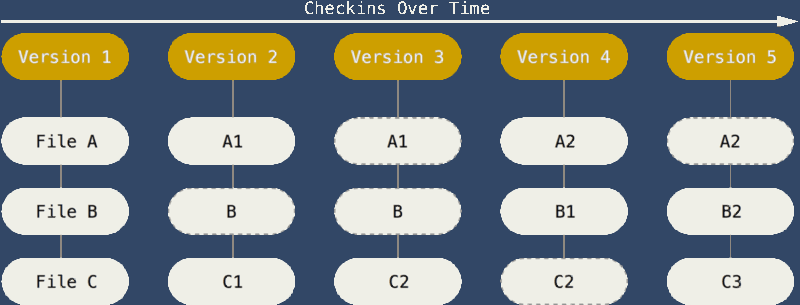

theme: Next, 1

# GIT GUD

---
[.build-lists: true]

# Agenda

1. Background
2. Basics
3. Advanced
4. Tips & Tricks
5. Best Practices

^
1. & 2. => Lecture
3. & 4. => Interactive
5. => Lecture

---

# Background
### What is `Git`?

^
Ask this question?

---

# VCS
### Version Control System

^
What does a VCS do?

---

> [...] a system that records changes to a file or set of files over time
-- Scott Chacon & Ben Straub [^ProGit]

---

## Version Control Systems

- `CVS`
- `Perforce`
- `SVN`
- `Mercurial`
- `Git`

^
Later: How they differ

---

# Open Source
### GNU GPL2

^
published under GNU General Public License version 2
^
Next Slide: What makes Git different from, for example, SVN

---

# Distributed

^
What does that mean? For this we have understand:

---

# Centralised
### VS
# Distributed

---

# Centralised


^
- Central repository = Single source of truth
- Server/Client communication

^
Examples: SVN, CVS, Perforce

---

# Distributed


^
- Each repository a full backup (with exceptions)
- Communication between repositories
- Possibel to do centralised approach

^
Examples: Git, Mercurial

---

# Basics

^
Who has more SVN than Git experience?
=> You'll be trouble

^
I could bore with commands, but you probably know those already.
Let's talk about how Git works internally => Helps a lot for advanced stuff
- Terminology
- Object model

---

# Expected Knowledge

- `add`
- `reset`
- `commit`
- `merge`

---


^
How to add changes? (Probably familiar with this)
Follow up: How does Git track changes?

---

## How does `Git` track changes?

---

# `Git` is different

^
Not only "Distributed"
=> The way `Git` thinks about it's files

---

> The major difference [...] is the way Git thinks about its data.
-- Scott Chacon & Ben Straub [^ProGit]

---

# Snapshots
## not
# Deltas



^
Deltas: What changed?
Snapshots: Current state

^
How does Git build this to a commit?

---

### *What is a*
# Commit

---


^
Commit -> Tree -> Tree | BLOB
Commit: Tree + Parents + Metadata

^
Git is closer to a filesystem then to a classic VCS
Next slide: How does Git identify objects?

---

# SHA1

^
Hash built over all properties of the object (Commit => Author, Committer etc.)
You might have heard to never change commits after pushing: Hash changes when properties change

---

# Try it out!

---

```
$ git init git-playground
Initialized empty Git repository in ...

$ cd git-playground

$ echo 'Some random text' > my_file

$ git hash-object -w my_file
1a76b8a41993e2c667f5b191fb57abdab2102a8b

$ git cat-file -t 1a76b8a41993e2c667f5b191fb57abdab2102a8b
blob

$ git cat-file -p 1a76b8a41993e2c667f5b191fb57abdab2102a8b
Some random text
```

^
You can actually find the blob in .git/objects/1a/76b8a41993e2c667f5b191fb57abdab2102a8b
Git only uses the content; create an identical file and the hash will be the same

---

# How history is made
### `Git` history at least


---


^
Each commit has a reference on it's parent => Single linked list
Not really single though ...

---

# Honour thy parent
### Navigate through history

^
Q: You want to remove the last commit, how?

---

# `^` and `~<N>`

```
$ git log --oneline -1 HEAD
810e72b Presentation - Basics: Add the ancestry operations slide

$ git log --oneline -1 HEAD^
85b332f Presentation - Basics: Git History

$ git log --oneline -1 HEAD^^
1a60452 Presentation: Reformat headlines

$ git log --oneline -1 HEAD~2
1a60452 Presentation: Reformat headlines
```

---

# Advanced
### From porcelain to plumbing

^
Porcelain: Clean CLI commands (like add, commit, reset)
Plumbing: Programmatically used low-level commands

---

## Clone workshop repository
### `git clone`
### `git@github.gcxi.de:swolf/git-workshop.git`

---

- (add|reset) patch
- rebase
- bisect

---

# `git bisect`
### The bug has to be here

---

# Best Practices

---

- Commit message
- Merging and rebasing
- Branching?

---

# Tables

With `:---:`, `---:` and `:---` you can center, right or right align the cell content.

  Header 1 |    Header 2   |   Header 3   |
-----------| :-----------: | -----------: |
Cell       |     _Cell_    |     *Cell*
Cell       |   **Cell**    |     __Cell__

[^ProGit]: https://git-scm.com/book/en/v2