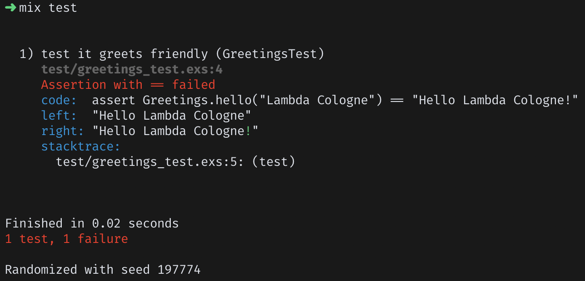
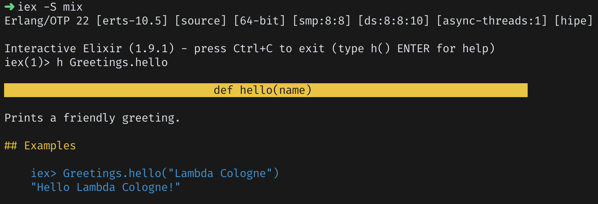
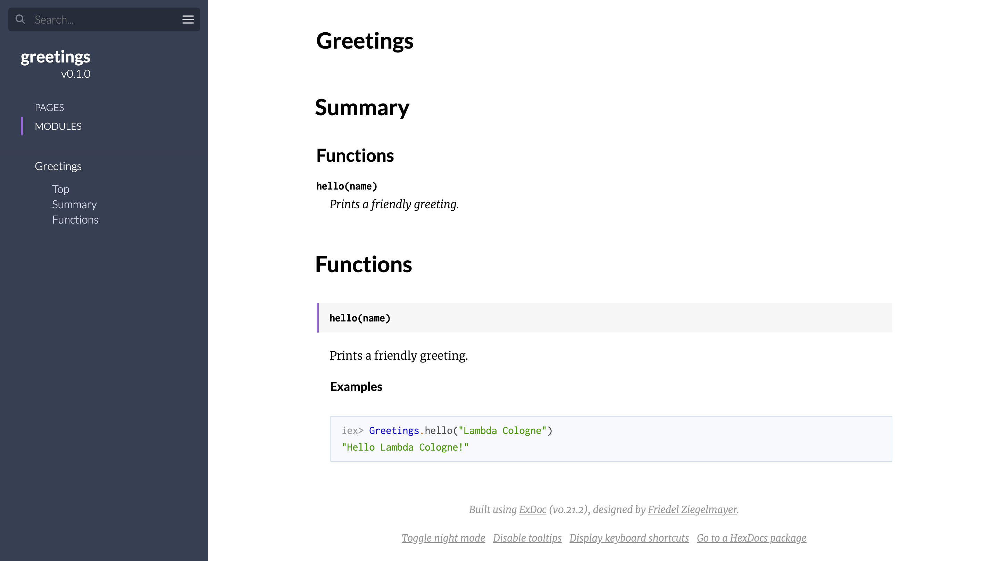
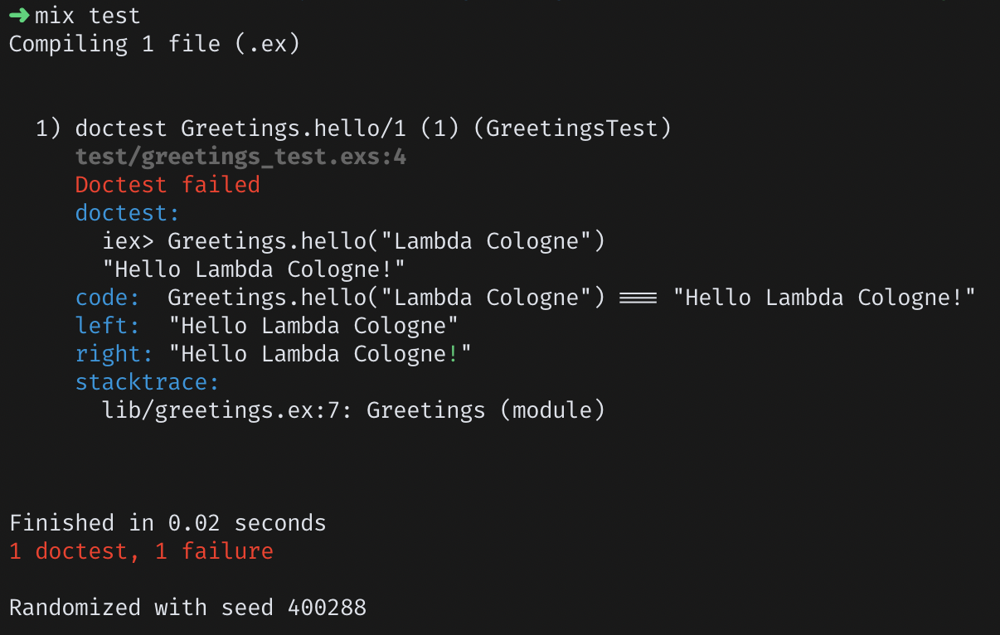

theme: Poster, 1
build-lists: true
footer: _`Sascha Wolf | 🐦 wolf4earth | saschawolf.me`_

[.background-color: #1F233D]
[.header-strong: #1F223D]

## **l**A**i**_Sip_**lll.**
## of _Elixir_

---


---
## What is *Elixir*?

---
> Elixir is a dynamic, functional language designed for building scalable and maintainable applications.
-- elixir-lang.org

^
Great sales pitch, right?

---
### To understand
## _Elixir_[^1]
### we need to understand its
## _History_

[^1]: and the problems it tries to solve

---
## The year is
# _2012_

---
# José _Valim_

^
Well-known Rubyist

---
# José _Valim_


` `

---
# José _Valim_


__A well-known Rubyist__

- _Rails_ 44.2k ⭐ (Contributor)
- _Devise_ 20.2k ⭐
- _Simple Form_ 7.5k ⭐
- And more ...

^
He became frustrated with Rubys approach to ...

---
# _Concurrency_

^
Why? CPUs don't get much faster, instead multiple CPUs

---


^
Compared different concurreny models

---
# _Erlang_

^
Running in ...

---
# _BEAM_
#### _Erlang_ VM

^
Concurrency: Using the ...

---
# _Actor_ Model[^2]

[^2]: `Technically almost-actor (https://www.youtube.com/watch?v=_0m0_qtfzLs)`

^
Q: Familiarity

^
Why almost? According to Dr. Carl Hewitt (inventor of the actor model in 1973)
Why? Because Erlang was designed without it's knowledge

---
[.background-color: #ffffff]
[.footer-style: #000000]
[.footer: `source: https://www.brianstorti.com/the-actor-model/`]


^
- Actor = fundamental unit of computation
- Isolation (shared nothing)
- Message passing
- Sequential processing

^
When message arrives (one of):
- Create more actors
- Send messages to other actors
- Designate what to do with the next message = Mutate State

---
## _Erlang_ was created
## at _Ericsson_ for
## _telephony switches_

---
- Distributed
- Fault-tolerant
- Soft real-time
- High-availability

^
- Light processes
- Hot-code reloading
- self-recovering

---
## Work on
## _Erlang_ started
## in _1987_

---
## It went
## _open-source_
## in _1998_

---
## _Battle-tested_
## in over _30 years_
## of _usage_

^
Sounds pretty good, right?

^
BUT ...

---
```erlang
-module(greetings).
-export([hello/1]).

hello(Name) ->
    io:format("Hello ~s~n", [Name]).
```

^
Syntax: Prolog-inspired
Not a bad language, but takes some getting used to
Old language which you notice

---
## ` `Ruby `       ` _Erlang_


^
Ruby = Developer productivity and happiness

^
Erlang = Powerful and battle-hardened concurrency

---


^
Remember, Erlang runs in a VM

---
# _BEAM_

^
A VM; just like the JVM

---
```erlang
-module(greetings).
-export([hello/1]).

hello(Name) ->
    io:format("Hello ~s~n", [Name]).
```


---
```elixir
defmodule Greetings do
  def hello(name) do
    IO.puts("Hello #{name}")
  end
end
```

^
`#{name}` = string interpolation

---
### _Ruby_
#### +
### _Erlang_
#### =
## **_Elixir_**

^
With the history out of the way, let's talk specifics

---
# **_Elixir_**

- Erlang compatibility
- developer happiness
- pattern-matching
- syntactic macro system

---
# _Erlang_ compatibily

^
What does that mean?

---
```erlang
-module(greetings).
-export([hello/1]).

hello(Name) ->
    io:format("Hello ~s~n", [Name]).
```

---
```elixir
defmodule Greetings do
  def hello(name) do
    :greetings.hello(name)
  end
end
```

^
A lot of Elixirs std just delegates to Erlang
Example: Enum.reverse

^
Not unlike the state of languages on the JVM

---
# _Developer_ Happiness

---
## _Great_ Tooling

- build tool `mix`
- code formatter
- unit testing framework
- first-class documentation
- and more ...

^
All maintained by the core team

^
Not gonna talk about `mix` and formatter

---
## Unit Testing Framework
### _`ExUnit`_

---
[.code-highlight: all]
[.code-highlight: 6]
```elixir
defmodule GreetingsTest do
  use ExUnit.Case, async: true

  test "it greets friendly" do
    assert Greetings.hello("Lambda Cologne") ==
             "Hello Lambda Cologne!"
  end
end
```

^
`async: true` because code is pure

^
*Highlight change with laser: "!" at the end*

^
Test failure looks like this:

---
[.background-color: #191918]



^
Tells us about the code, the left value, the right value etc.

^
"Knows" we used `==`: How?
Syntactic Macro System - `assert` is a macro

---
## First-Class _Documentation_

^
Okay, what does that mean?

---
[.hide-footer]


^
Elixir takes good docs seriously

---
```elixir
defmodule Greetings do
  @doc """
  Prints a friendly greeting.

  ## Examples

      iex> Greetings.hello("Lambda Cologne")
      "Hello Lambda Cologne!"
  """
  def hello(name) do
    IO.puts("Hello #{name}")
  end
end
```

^
First: docs are **not** comments

^
`@doc` is a **module attribute**; basically a module-level constant

---
[.background-color: #191918]



^
Neat but not **that** impressive

---
[.hide-footer]



---
```elixir
defmodule GreetingsTest do
  use ExUnit.Case, async: true

  doctest Greetings
end
```

---
[.background-color: #191918]



---
# And _more_ ...

- Powerful interactive console (`iex`)
- "Batteries included" web framework (Phoenix)
- A bunch more neat Erlang/OTP things:
- Supervision trees, observer, remote debugging, hot code upgrades ...

^
iex: Auto-complete, great data inspection, docs, command history etc.

^
Phoenix: We're gonna hear a bit more about this from Peter, I think

---
# _Pattern_
# Matching

^
Q: Who here is familiar with pattern matching? (FP-ler should?)

^
Similar: Destructuring?

---
```elixir
iex> my_list = [3, 1, 4, 1, 5, 9, 2, 6, 5]
iex> [first, second | rest] = my_list
iex> first
3
iex> second
1
iex> rest
[4, 1, 5, 9, 2, 6, 5]
```

---
```elixir
iex> my_map = %{a: 1, b: 2, c: 3}
iex> %{a: a, b: b} = my_map
iex> a
1
iex> b
2
```

---
```elixir
iex> greeting = "Hello Lambda Cologne"
iex> "Hello " <> name = greeting
iex> name
"Lambda Cologne"
```

---
## _Pattern_ Matching
## is everywhere

---
```elixir
defmodule Greetings do
  def hello("") do
    hello("anonymous")
  end

  def hello("Lambda " <> city) do
    hello("FP-Enthusiast from #{city}")
  end

  def hello(name) do
    "Hello #{name}!"
  end
end
```

^
Clauses are "tried" in order of declaration

^
Pretty common pattern (not the stupid greetings):
Multiple clauses matching and calling each other

^
I could talk more about pattern matching but we have limited time ...

---
# _Syntactic_
# Macros

^
Q: Who knows what that is?
Q2: Who knows what macros are?

---

### Transform the
# _AST_
#### _A_bstract _S_yntax _T_ree

^
C-Macros: Fancy string replacement

^
Languages: Lisp (most well-known), Rust, Elixir, and more
Lisp: Basically write the AST directly

^
Why is that cool?

---

## Use the _full_
## power of _Elixir_