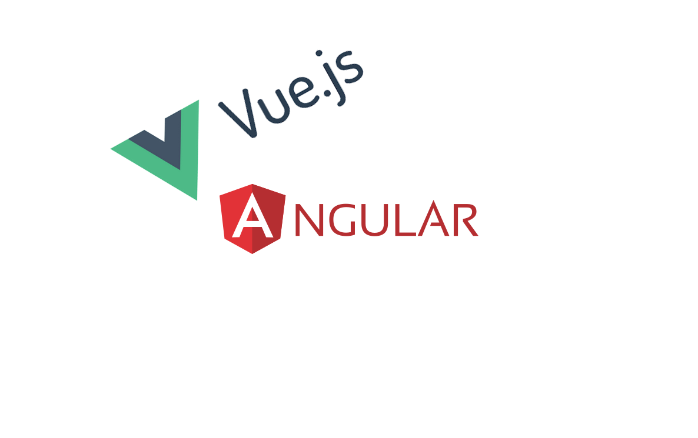
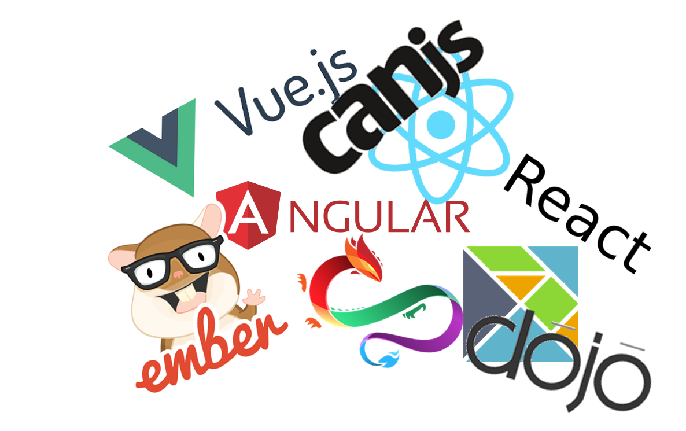
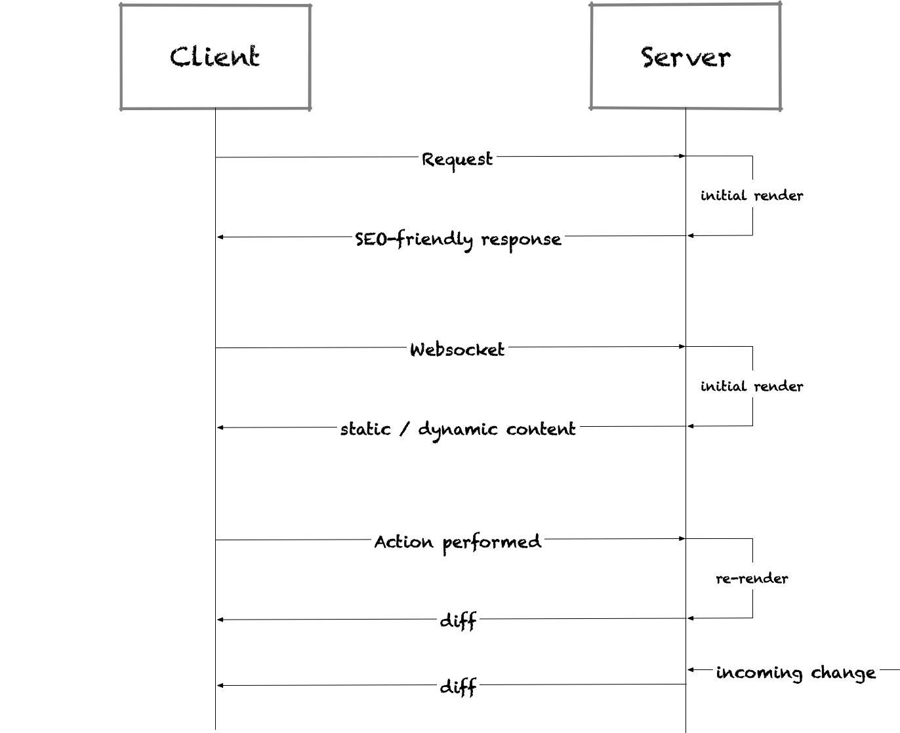
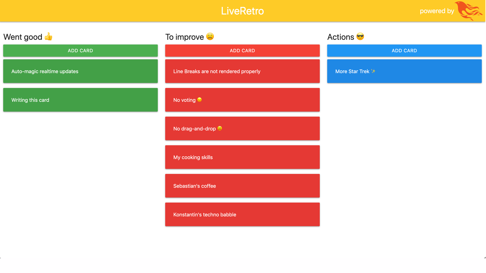
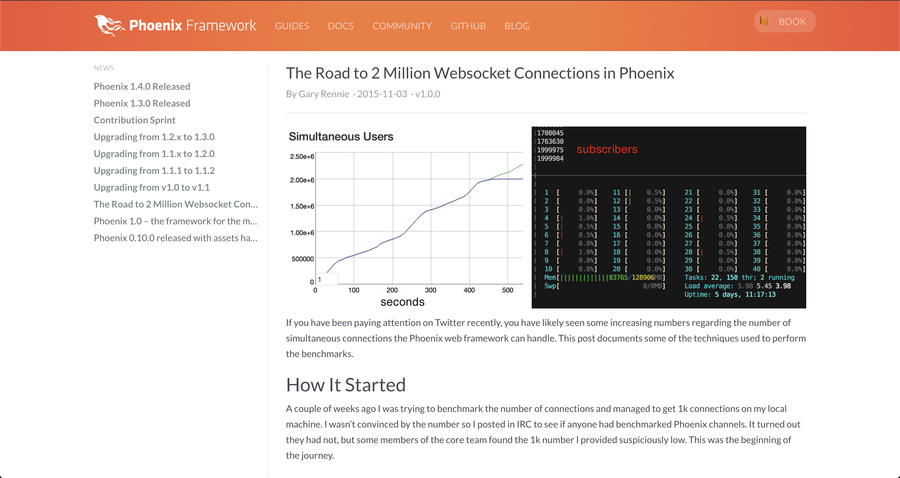
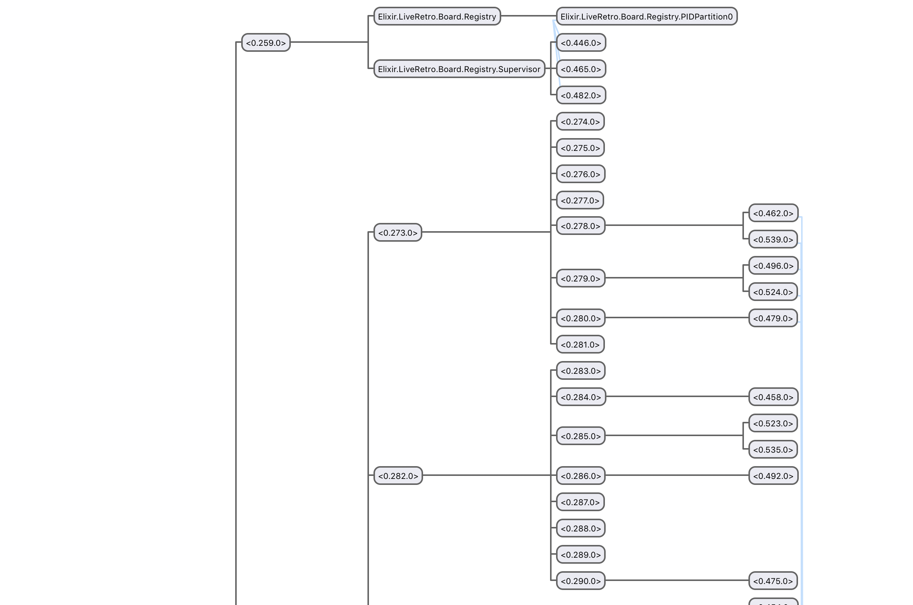

theme: Ostrich, 3
build-lists: true
footer: `🐦 wolf4earth | saschawolf.me`

# [fit] Beyond the SPA
## [fit] __Interactive web apps without writing JS__

---

<!-- ## In the
# __distant__
## past -->
## A __long__ time ago ...

^
In an web far away ...

---


^
The early lifeforms on earth were using something called:

---
[.background-color: #476DA1]


^
WEB 1.0:
- everything was static
- read some text, clicked some links
- nothing happened

---


---


^
Things got moving!

---

```javascript
$("#search-submit").click(function() {
  $("#search form").submit()
});
```

^
And some awesome code was written!

^
We used jQuery for everything!

---
[.background-color: #FFFFFF]
[.footer-style: #000000]


^
From here web development evolved further

---
[.background-color: #FFFFFF]
[.footer-style: #000000]


---
[.background-color: #ffffff]
[.footer-style: #000000]


---
[.background-color: #ffffff]
[.footer-style: #000000]



---
[.background-color: #ffffff]
[.footer-style: #000000]


---
[.background-color: #ffffff]
[.footer-style: #000000]


---
[.background-color: #ffffff]
[.footer-style: #000000]


---
[.background-color: #ffffff]
[.footer-style: #000000]


---
[.background-color: #ffffff]
[.footer-style: #000000]



---
[.background-color: #ffffff]
[.footer-style: #000000]


---
[.background-color: #ffffff]
[.footer-style: #000000]


---
[.background-color: #ffffff]
[.footer-style: #000000]


^
There is even a website to help you decide

---
[.footer: ]


^
And that's not even considering:

---
[.background-color: #ffffff]
[.footer-style: #000000]
[.footer: `source: http://www.modulecounts.com/`]


^
- state handling
- routing (if SPA)
- thousands of other packages

---
# #__JS__Fatigue

^
And the fun only began:

---

## What about the
# __backend__?

^
- API documentation
- Websockets for server-triggered updates

---

> Is all of this *really* necessary?
-- An overwhelmed dev

^
- Huge additional tech stack
- Loads of complexity

---

> Simplicity is prerequisite for reliability.
-- E. W. Dijkstra

---

> I hate code, and I want as little of it as possible in our product.
-- Jack Diederich

---

# [fit] <graph: static to dynamic>

---

# [fit] <graph: static to dynamic - annotated with static stuff>

---

# [fit] <graph: static to dynamic - annotated with static and dynamic stuff>

^
Sometimes it makes sense: Google Docs, Maps, Games, etc.

---

# [fit] <graph: static to dynamic - what about the middle?>

^
Examples:
- Dashboards
- Trello, Fun Retro
- Pushing updates from the server

---

## Isn't there an __alternative__?

^
There might be ...

---
[.background-color: #000000]


# __Phoenix__
# Live View

---
[.background-color: #000000]

# Demo


^
- LiveRetro
- Flappy Bird
- TODO: More demos

---

```
$ wc -l ...
 37 lib/live_retro/board/board.ex
 13 lib/live_retro/board/card.ex
 39 lib/live_retro/board/registry.ex
 15 lib/live_retro/board/storage.ex
 20 lib/live_retro_web/controllers/board_controller.ex
 44 lib/live_retro_web/views/board_view.ex
 81 lib/live_retro_web/live/board_live.ex
249 total
```

^
The code I've actually written!

^
Other code: generated boilerplate, config ...

---

> How does this work?
-- Probably you right now

---
[.background-color: #ffffff]
[.footer-style: #000000]



^
Initial render means it's super SEO friendly
=> <TODO: GET SOME DATA HERE>

---

# [fit] <graph: lifecycle - highlight socket>

---

# __Change__ Tracking

---
[.background-color: #ffffff]
[.footer-style: #000000]


---
[.code-highlight: 1-11]
[.code-highlight: 2, 5, 7]
[.code-highlight: 1, 3-4, 6, 8-11]

```html
<item>
  <div class="card <%= color_for(@type) %> darken-1">
    <a href="#"
       phx-click="edit"
       phx-value="<%= @id %>">
      <div class="card-content white-text">
        <%= @text %>
      </div>
    </a>
  </div>
</item>
```

---
[.code-highlight: 1-11]
[.code-highlight: 2-4]

```javascript
{
  0: "red",
  1: "A0202252-7778-440A-A117-9C2476D418AF",
  2: "My great card!",
  "static": [
    "<item><div class=\"card ",
    " darken-1\"><a href=\"#\" phx-click=\"edit\" phx-value=\"",
    "\"><div class=\"card-content white-text\">",
    "</div></a></div></item>"
  ]
}
```

---
[.code-highlight: 2-4]
[.code-highlight: 5-10]

```javascript
{
  0: "red", // color_for(@type)
  1: "A0202252-7778-440A-A117-9C2476D418AF", // @id
  2: "My great card!", // @text
  "static": [
    "<item><div class=\"card ",
    " darken-1\"><a href=\"#\" phx-click=\"edit\" phx-value=\"",
    "\"><div class=\"card-content white-text\">",
    "</div></a></div></item>"
  ]
}
```

^
What happens when somebody changes the text of the card?

---
<!-- TODO: Verify data structure -->

```javascript
{ 2: "My changed card!" }
```

^
What happens on the client?

---
[.code-highlight: 4]

```javascript
{
  0: "red",
  1: "A0202252-7778-440A-A117-9C2476D418AF",
  2: "My changed card!",
  "static": [
    "<item><div class=\"card ",
    " darken-1\"><a href=\"#\" phx-click=\"edit\" phx-value=\"",
    "\"><div class=\"card-content white-text\">",
    "</div></a></div></item>"
  ]
}
```

^
Okay but how do we get from here to there:

---

# [fit] <screenshot: card with changed text>

^
Surprisingly simple! It taskes this:

---
[.code-highlight: 1-11]
[.code-highlight: 2-4]
[.code-highlight: 5-10]

```javascript
{
  0: "red",
  1: "A0202252-7778-440A-A117-9C2476D418AF",
  2: "My changed card!",
  "static": [
    "<item><div class=\"card ",
    " darken-1\"><a href=\"#\" phx-click=\"edit\" phx-value=\"",
    "\"><div class=\"card-content white-text\">",
    "</div></a></div></item>"
  ]
}
```

^
Zips dynamic with static

---

```javascript
[
    "<item><div class=\"card ",
    "red",
    " darken-1\"><a href=\"#\" phx-click=\"edit\" phx-value=\"",
    "A0202252-7778-440A-A117-9C2476D418AF",
    "\"><div class=\"card-content white-text\">",
    "My great card!",
    "</div></a></div></item>"
]
```

---
[.code-highlight: 3, 5, 7]
[.code-highlight: 2, 4, 6, 8]

```javascript
[
    "<item><div class=\"card ",
    "red", // Index 0
    " darken-1\"><a href=\"#\" phx-click=\"edit\" phx-value=\"",
    "A0202252-7778-440A-A117-9C2476D418AF", // Index 1
    "\"><div class=\"card-content white-text\">",
    "My great card!", // Index 2
    "</div></a></div></item>"
]
```

^
And now just "join"

---
[.code-highlight: 9]

```javascript
[
    "<item><div class=\"card ",
    "red",
    " darken-1\"><a href=\"#\" phx-click=\"edit\" phx-value=\"",
    "A0202252-7778-440A-A117-9C2476D418AF",
    "\"><div class=\"card-content white-text\">",
    "My great card!",
    "</div></a></div></item>"
].join("")
```

---

```html
<item>
  <div class="card red darken-1">
    <a href="#"
       phx-click="edit"
       phx-value="A0202252-7778-440A-A117-9C2476D418AF">
      <div class="card-content white-text">
        My changed card!
      </div>
    </a>
  </div>
</item>
```

---

## Isn't this __slow__?

^
This must be slow, right?

---

# `morph`__`dom`__ [^1]

[^1]: https://github.com/patrick-steele-idem/morphdom

^
morphdom updates the DOM smartly

---
[.code-highlight: 1-11]
[.code-highlight: 7]

```html
<item>
  <div class="card red darken-1">
    <a href="#"
       phx-click="edit"
       phx-value="A0202252-7778-440A-A117-9C2476D418AF">
      <div class="card-content white-text">
        My great card!
      </div>
    </a>
  </div>
</item>
```

---
[.code-highlight: 7]

```html
<item>
  <div class="card red darken-1">
    <a href="#"
       phx-click="edit"
       phx-value="A0202252-7778-440A-A117-9C2476D418AF">
      <div class="card-content white-text">
        My changed card!
      </div>
    </a>
  </div>
</item>
```

---

- Efficent change tracking
- SEO-friendly initial render
- Very small payloads
- Fast and simple DOM updates

^
Efficient on the: server, wire, client

^
A question might remain though

---

## But why
# __Elixir__?

^
Couldn't we just build this with X?
Yes we could, but Elixir is uniquely suited!

---

#### Why Elixir?
# Reason __1__

---

# __Phoenix__
# is _fast_

---
[.background-color: #ffffff]
[.footer-style: #000000]



---

```
[info] GET /board/decline-crouch-ordinary-sea-brain-round
[info] Sent 200 in 627µs
```

---

# `627`__`µs`__

---

# `0.627`__`ms`__

---

#### Why Elixir?
# Reason __2__

---

# __Phoenix__
# scales

---
[.background-color: #000000]
[.footer: ]



# Vertically*[^2]*

[^2]: https://phoenixframework.org/blog/the-road-to-2-million-websocket-connections

---
[.footer: ]

# Horizontally*[^3]*

[^3]: http://erlang.org/doc/reference_manual/distributed.html

^
Built-in distribution in the VM

^
To explain a little detour ...

^
You see, Elixir is ...

---

## __Standing__ on
## the __shoulders__
## of __giants__

---
# __BEAM__
##### <br/>

---
# __BEAM__
##### Erlang VM

---


^
Let's BEAM some knowledge in our heads

---

## __Erlang__ was created
## at __Ericsson__ for
## __telephony switches__

---

- Distributed
- Fault-tolerant
- Soft real-time
- High-availability

^
- Light processes
- Hot-code reloading
- self-recovering

---

## Work on
## __Erlang__ started
## in __1987__

---

## It went
## __open-source__
## in __1998__

---

## __Battle-tested__
## in over __30 years__
## of __usage__

---

# __Actor__ Model

^
Q: Familiarity

---
[.background-color: #ffffff]
[.footer-style: #000000]
[.footer: `source: https://www.brianstorti.com/the-actor-model/`]


^
- Isolation (shared nothing)
- Message passing
- Sequential processing

---

## Each __Live View__
## is a __separate__
## __process__

^
Processes:
- Websocket
- Web Request
- DB Connections
- State Machines

---

#### Why Elixir?
# Reason __3__

^
One huge benefit this brings is:

---

# __Isolation__

^
Okay, what do I mean by that

---

> Let it crash!
-- Old Erlang Wisdom

^
DEMO

---

# __Supervison__
# Trees

---
[.background-color: #ffffff]
[.footer-style: #000000]



^
Actual screenshot: 5 tabs open

^
Other benefits - too much for this talk

---


^
- for-comprehensions: Static data only sent once
- Not limited to JSON
- Of course only one TechStack

---
## When to use __LiveView__?

- "Real-time" collaboration
- Admin Dashboards
- Autocompletion
- Multi-step forms
- And probably more

---
## When to __not__ use __LiveView__?

- Desktop-like (Google Docs, Maps ...)
- Offload Heavy computing
- Offline capabilities
- Zero latency
- And probably more

---

### Thank you for
## __listening__

---

# __Questions?__