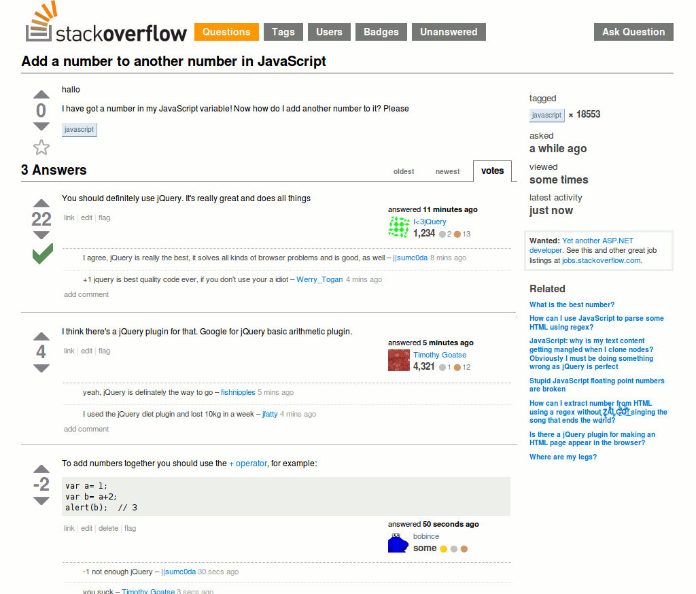
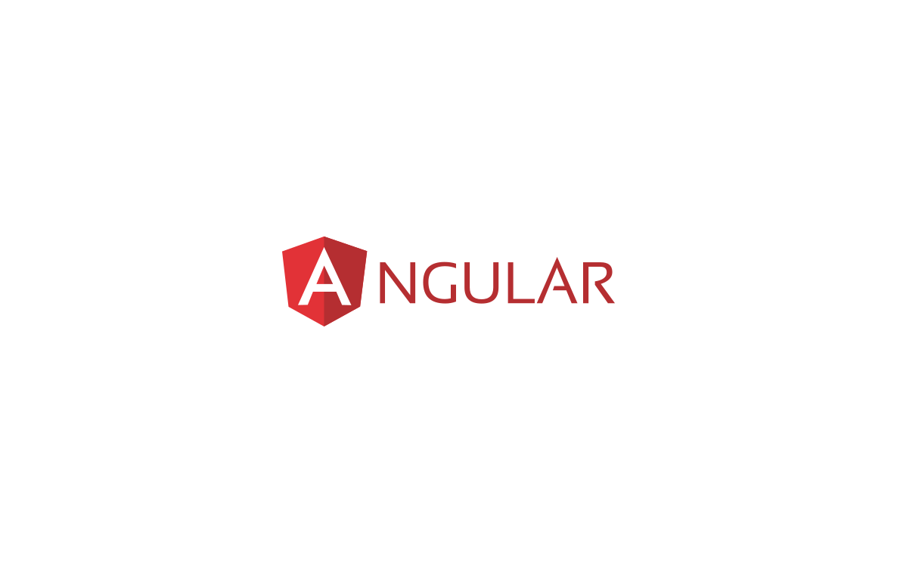
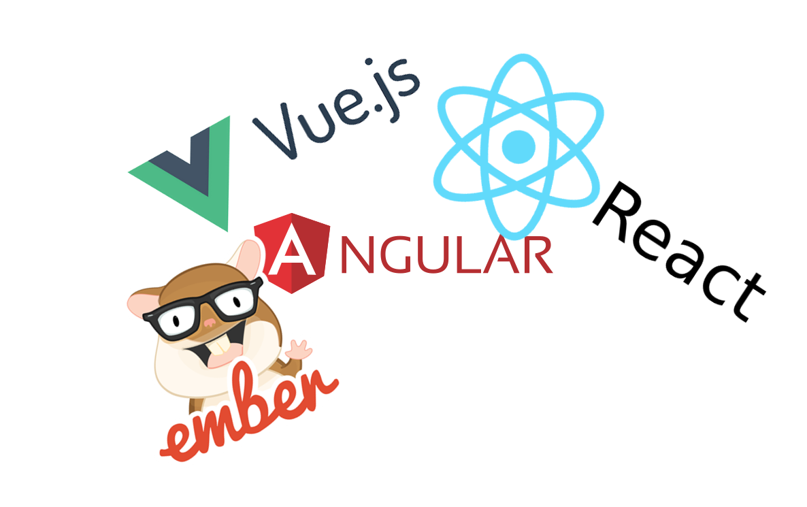
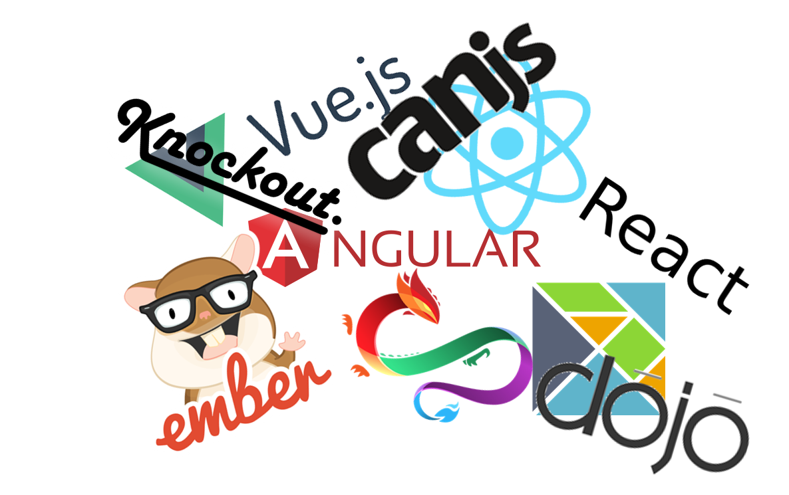
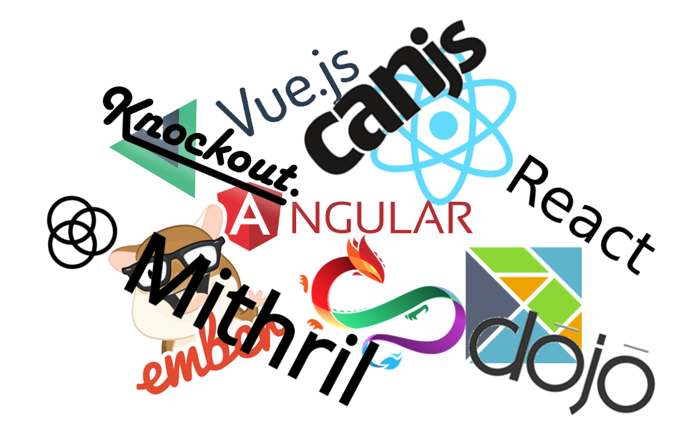
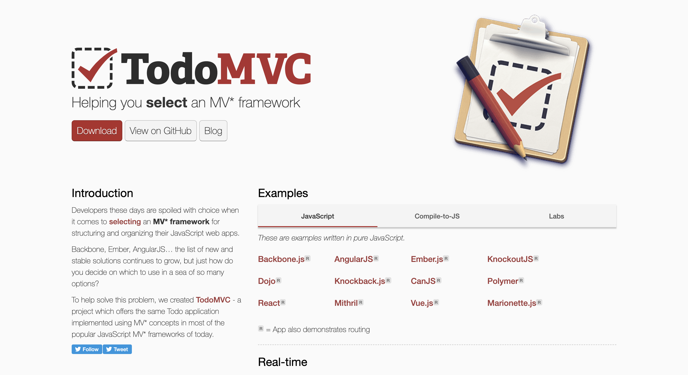
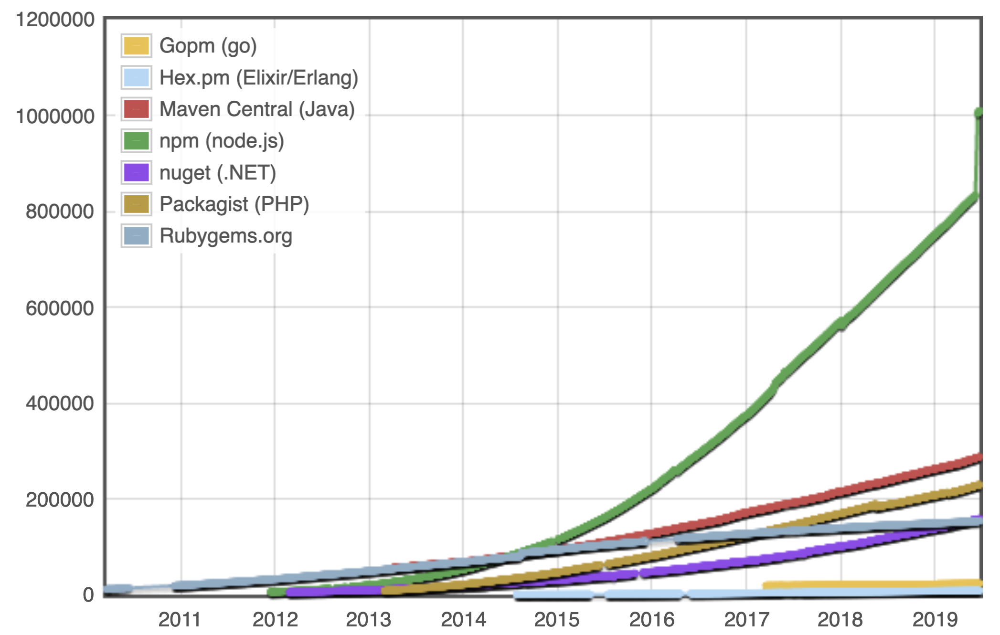
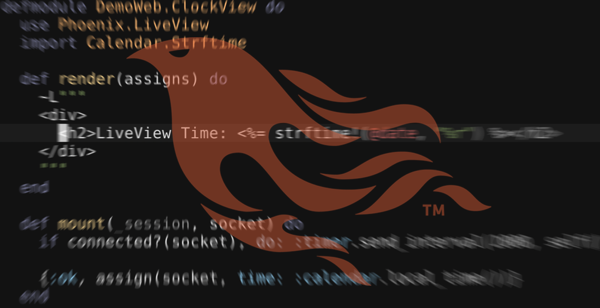

theme: Ostrich, 3
footer: `🐦 wolf4earth | saschawolf.me`

# [fit] Beyond the SPA
## [fit] __Interactive web apps without writing JS__

---

<!-- ## In the
# __distant__
## past -->
## A __long__ time ago ...

^
In an web far away ...

---


^
The early lifeforms on earth were using something called:

---
[.background-color: #476DA1]


^
WEB 1.0:
- everything was static
- read some text, clicked some links
- nothing happened

---


---


^
Things got moving!

---

```javascript
$("#search-submit").click(function() {
  $("#search form").submit()
});
```

^
And some awesome code was written!

^
We used jQuery for everything!

---
[.background-color: #FFFFFF]
[.footer-style: #000000]



^
From here web development evolved further

---
[.background-color: #FFFFFF]
[.footer-style: #000000]


---
[.background-color: #ffffff]
[.footer-style: #000000]



---
[.background-color: #ffffff]
[.footer-style: #000000]


---
[.background-color: #ffffff]
[.footer-style: #000000]


---
[.background-color: #ffffff]
[.footer-style: #000000]



---
[.background-color: #ffffff]
[.footer-style: #000000]


---
[.background-color: #ffffff]
[.footer-style: #000000]


---
[.background-color: #ffffff]
[.footer-style: #000000]


---
[.background-color: #ffffff]
[.footer-style: #000000]



---
[.background-color: #ffffff]
[.footer-style: #000000]



---
[.background-color: #ffffff]
[.footer-style: #000000]


^
There is even a website to help you decide

---
[.footer: ""]



^
And that's not even considering:

---
[.background-color: #ffffff]
[.footer-style: #000000]
[.footer: `source: http://www.modulecounts.com/`]



^
- state handling
- routing (if SPA)
- thousands of other packages

---
# #__JS__Fatigue

^
And the fun only began:

---

## What about the
# __backend__?

^
- API documentation
- Websockets for server-triggered updates

---

> Is all of this *really* necessary?
-- An overwhelmed dev

^
- Huge additional tech stack
- Loads of complexity

---

> Simplicity is prerequisite for reliability.
-- E. W. Dijkstra

---

> I hate code, and I want as little of it as possible in our product.
-- Jack Diederich

---

# [fit] <graph: static to dynamic>

---

# [fit] <graph: static to dynamic - annotated with static stuff>

---

# [fit] <graph: static to dynamic - annotated with static and dynamic stuff>

^
Sometimes it makes sense: Google Docs, Maps, Games, etc.

---

# [fit] <graph: static to dynamic - what about the middle?>

^
Examples:
- Dashboards
- Trello, Fun Retro
- Pushing updates from the server

---

## Isn't there an __alternative__?

^
There might be ...

---
[.background-color: #000000]



# __Phoenix__
# Live View

---
[.background-color: #000000]

# Demo


^
- LiveRetro
- Flappy Bird
- TODO: More demos

---

> How does this work?
-- Probably you right now

---
[.background-color: #ffffff]
[.footer-style: #000000]


^
Initial render means it's super SEO friendly

---

# [fit] <graph: lifecycle - highlight socket>

---

# __Change__ Tracking

---
[.background-color: #ffffff]
[.footer-style: #000000]


---
[.code-highlight: 1-11]
[.code-highlight: 2, 5, 7]
[.code-highlight: 1, 3-4, 6, 8-11]

```html
<item>
  <div class="card <%= color_for(@type) %> darken-1">
    <a href="#"
       phx-click="edit"
       phx-value="<%= @id %>">
      <div class="card-content white-text">
        <%= @text %>
      </div>
    </a>
  </div>
</item>
```

---
[.code-highlight: 1-11]
[.code-highlight: 2-4]

```javascript
{
  0: "red",
  1: "A0202252-7778-440A-A117-9C2476D418AF",
  2: "My great card!",
  "static": [
    "<item><div class=\"card ",
    " darken-1\"><a href=\"#\" phx-click=\"edit\" phx-value=\"",
    "\"><div class=\"card-content white-text\">",
    "</div></a></div></item>"
  ]
}
```

---
[.code-highlight: 2-4]
[.code-highlight: 5-10]

```javascript
{
  0: "red", // color_for(@type)
  1: "A0202252-7778-440A-A117-9C2476D418AF", // @id
  2: "My great card!", // @text
  "static": [
    "<item><div class=\"card ",
    " darken-1\"><a href=\"#\" phx-click=\"edit\" phx-value=\"",
    "\"><div class=\"card-content white-text\">",
    "</div></a></div></item>"
  ]
}
```

^
What happens when somebody changes the text of the card?

---
<!-- TODO: Verify data structure -->

```javascript
{ 2: "My changed card!" }
```

^
What happens on the client?

---
[.code-highlight: 4]

```javascript
{
  0: "red",
  1: "A0202252-7778-440A-A117-9C2476D418AF",
  2: "My changed card!",
  "static": [
    "<item><div class=\"card ",
    " darken-1\"><a href=\"#\" phx-click=\"edit\" phx-value=\"",
    "\"><div class=\"card-content white-text\">",
    "</div></a></div></item>"
  ]
}
```

^
Okay but how do we get from here to there:

---

# [fit] <screenshot: card with changed text>

^
Surprisingly simple! It taskes this:

---
[.code-highlight: 1-11]
[.code-highlight: 2-4]
[.code-highlight: 5-10]

```javascript
{
  0: "red",
  1: "A0202252-7778-440A-A117-9C2476D418AF",
  2: "My changed card!",
  "static": [
    "<item><div class=\"card ",
    " darken-1\"><a href=\"#\" phx-click=\"edit\" phx-value=\"",
    "\"><div class=\"card-content white-text\">",
    "</div></a></div></item>"
  ]
}
```

^
Zips dynamic with static

---

```javascript
[
    "<item><div class=\"card ",
    "red",
    " darken-1\"><a href=\"#\" phx-click=\"edit\" phx-value=\"",
    "A0202252-7778-440A-A117-9C2476D418AF",
    "\"><div class=\"card-content white-text\">",
    "My great card!",
    "</div></a></div></item>"
]
```

---
[.code-highlight: 3, 5, 7]
[.code-highlight: 2, 4, 6, 8]

```javascript
[
    "<item><div class=\"card ",
    "red", // Index 0
    " darken-1\"><a href=\"#\" phx-click=\"edit\" phx-value=\"",
    "A0202252-7778-440A-A117-9C2476D418AF", // Index 1
    "\"><div class=\"card-content white-text\">",
    "My great card!", // Index 2
    "</div></a></div></item>"
]
```

^
And now just "join"

---
[.code-highlight: 9]

```javascript
[
    "<item><div class=\"card ",
    "red",
    " darken-1\"><a href=\"#\" phx-click=\"edit\" phx-value=\"",
    "A0202252-7778-440A-A117-9C2476D418AF",
    "\"><div class=\"card-content white-text\">",
    "My great card!",
    "</div></a></div></item>"
].join("")
```

---

```html
<item>
  <div class="card red darken-1">
    <a href="#"
       phx-click="edit"
       phx-value="A0202252-7778-440A-A117-9C2476D418AF">
      <div class="card-content white-text">
        My changed card!
      </div>
    </a>
  </div>
</item>
```

---

## Isn't this __slow__?

^
This must be slow, right?

---

# `morph`__`dom`__ [^1]

[^1]: https://github.com/patrick-steele-idem/morphdom

^
morphdom updates the DOM smartly

---
[.code-highlight: 1-11]
[.code-highlight: 7]

```html
<item>
  <div class="card red darken-1">
    <a href="#"
       phx-click="edit"
       phx-value="A0202252-7778-440A-A117-9C2476D418AF">
      <div class="card-content white-text">
        My great card!
      </div>
    </a>
  </div>
</item>
```

---
[.code-highlight: 7]

```html
<item>
  <div class="card red darken-1">
    <a href="#"
       phx-click="edit"
       phx-value="A0202252-7778-440A-A117-9C2476D418AF">
      <div class="card-content white-text">
        My changed card!
      </div>
    </a>
  </div>
</item>
```

---

# __Wait!__
### There's more

---
[.build-lists: true]

- Nested views are possible
- `for`-comprehensions are optimized
- Optimized data transfer
- Isolation of views

^
2. Static data is only sent once
3. Roadmap, use something else then JSON

---

## Isolation of views?

---

## __Isolation__ of views?

---

# DEMO

---

### Thank you for
## __listening__

---

# __Questions?__