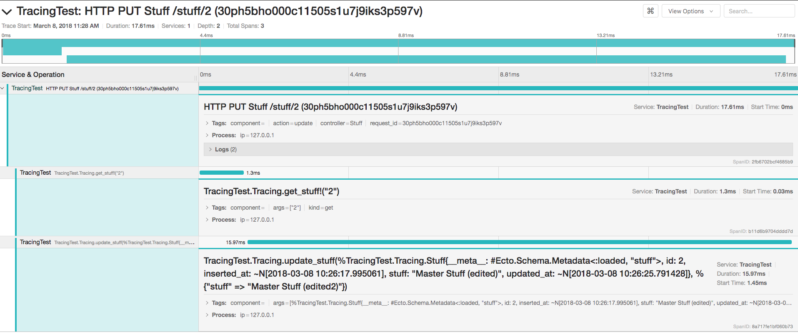
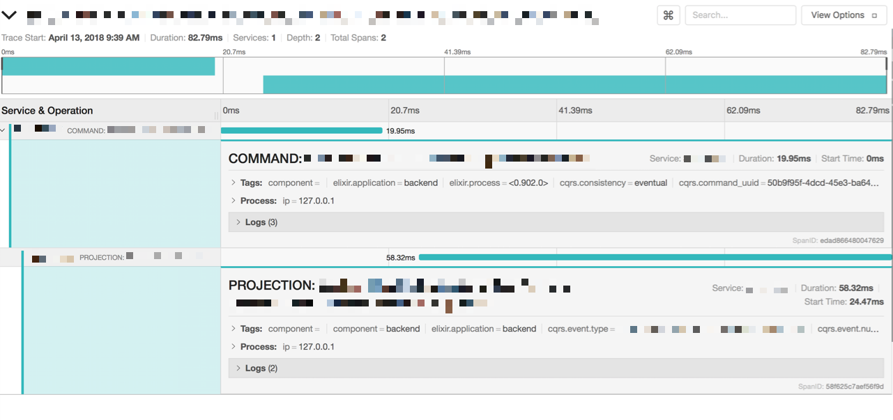

build-lists: true
theme: Poster, 1

# Tracing
### *In Elixir*

^
Asked myself what this talk should be about ...
- Technical details?
- Scaling?
- Issues?
-> Story

---

# Let's meet *Alexander*

---

# 👨‍💻

^
Backend Developer at a random compomany, let's say

---

# **Smallcentrix**

---

> We need more diagnostics!
-- Pretty much everybody

---


^
- elixir diagnostics (Healthcare)
- elixir tracing

---

# 🤷‍♂️

^
- Where to start? What makes sense?
- Ask experienced colleague, Senior Developer, if you want

---

# 🧙‍♂️

---

> Look at OpenTracing, you scrub!
-- 🧙‍♂️

^
Pretty much the exchange

^
"Before we look at OT, let's ask ourselfs ..."

---

# What exactly
# *is* tracing?

^
Question!

^
"Tracing is about ..."

---

# Analyzing
# Transactions

^
"But ..."

---

# Tracing
# is *hard*

^
Question: Why?

---

- Contexts need to be passed around
- Within and between processes
- Through OSS packages (ORM etc.)
- Self-contained services (NGINX, Redis etc.)
- Arbitrary glue code and business logic

^
Unreasonable to abide to single vendor specifications

---

# Vendor
# Lock-in

---


^
Not going to explain OT in detail, couldn't do it anyway

---

## Timed Operations
#### called *Spans*

---

## Relations between
## *Spans*

---

## Context Propagation

^
Getting Span information from one system into another

^
"For this OpenTracing standardizes ..."

---

- Span management (start, finish, decorate)
- Inter-process propagation (overcome process boundaries)
- Active span management (store, retrieve)

^
"Ok, so this is OpenTracing ..."

---

# What about Elixir?

---

# OTTER
#### *O*pen*T*racing *T*oolkit for *Er*lang


---

## Partial
## OpenTracing
## Implementation

---

- Span management (start, finish, decorate)
- Kinda: Active span management

^
Active: Per-Process span "caching", not crossing process boundaries

---

# ExRay
#### Tracing annotations built with OTTER


---

```elixir
defmodule Stuff do
  use ExRay, pre: :start_span, post: :finish_span

  defp start_span(context), do: ...
  defp finish_span(context, span, result), do: ...

  @trace kind: "list"
  def list_stuff do
    Stuff.Repo.all(Stuff)
  end

  ...
end
```

---

# Remember 👨‍💻?

---

## He built a
## Proof of Concept

---



^
Screenshot from Jaeger UI, distributed tracing system by Uber

---

# 🎉🎉🎉

^
Everybody was like "Yeeeaaaah"

---

## Integrate it
## into the project!

^
Must be easy now, right?

---

# Tracing Plug

^
1. Create span and add some tags
2. Wait for response
3. Finish span

---

# 🎉🎉🎉

^
Now he actually wants to see what a request DOES!

^
ALEX WANTED TO GO DEEPER!

---


^
"But for that, he had to ..."

---

# Cross Process Boundaries

^
"Why? Because, you see, the project was ..."

---

# Event-driven

^
He wanted to see what an event triggered!

^
"Which meant, Alex needed ..."

---

# Inter-Process Propagation

^
Remember OTTER? Partial Implementation? What exactly did it gave Alex?

---

- Span management
- Kinda: Active span management
- *No* inter-process propagation


^
"Well ..."

---

# 💩

^
"Here Alexander ..."

---


---

# Options?

^
Question: Ask this!

---

1. Inject tracing contexts "into" events
2. Save tracing contexts globally
3. Generate span ID from input
4. Use unique event data as span IDs

^
1. Where?
2. scaling issues
3. collision risk (that bad?), obscure
4. UUIDs but we need 64bit integer

---

## What did 👨‍💻 do?

---

## Inserted Span IDs
## into event metadata

^
1. Option

---

## Used these IDs
## downstream to
## correlate spans

^
Basically built ...

---

## Custom
## inter-process
## propagation

^
"Now finally he could ..."

---



---

# Take away?

---

- Tracing is *hard*
- OpenTracing has neat ideas
- Tooling in Elixir/Erlang still has need for improvement

---

# **Questions?**
#### Slides on GitHub[^1]

[^1]: https://github.com/Zeeker/talks


^
Used those downstream to correlate the spans to each other