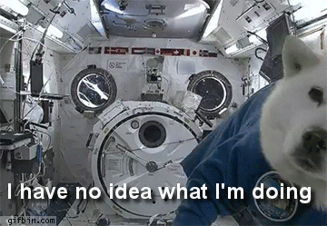

build-lists: true
theme: Courier, 7

# [fit] Template

---

## <insert goal>

---

## I want to take you on a
# journey

---

## Meet Alex
# 👨‍💻

---

# Alex is a developer

---

## He just started at this
# cool company

^
Let's call them ...

---

# Smallcentrix

---

## They are pretty big on
# Clean Code

---

## He starts working
## on his first project

---

## They tell him to
# write tests

^
No experience doing that

---

# :scream:

---



---

## Alex asks himself
# Why?

---

> It costs time!

---

> It's annoying!

---

> I can test manually!

---

## But he starts to write tests

---

## <angry typing gif>?

^
This is ...

---

## It's painful

---

## The tests break with the smallest change

---

## They take a lot of time to maintain

---

## They are hard to read

---

## Alex is frustated

---

# <rage.gif>?

---

## A senior developer
## approaches him
# 🧙‍♂️

---

> Let's do this together

---

# Test Pyramid

- A lot of Unit Tests
- Less Integration Tests
- Even less Acceptance/UI Tests
- Some manual tests


---

# Acceptance Tests
## UI Tests

---

# Acceptance/UI Tests

- High-level testing
- Ensure requirements are being fulfilled
- A topic on it's own

^
~10%
Not focussing on this

---

# Integration Tests

---

# Integration Tests

- Test parts working together
- Black box testing
- Does not care about inner workings

^
Relevant, but we'll focus on

---

# Unit Tests

- Test single "units" in isolation
- Independent from each other
- Good unit tests act as ...
  + design specifications
  + documentation

^
You might ask, and Alex does too, ...

---

> What makes a good Unit Test?
-- Alex

---

> First you need to understand how to write testable units
-- 🧙‍♂️

---

# Example

---

```python
def get_time_of_day():
  now = datetime.now()

  if now.hour >= 0 and now.hour < 6:
    return "night"
  elif now.hour >= 6 and now.hour < 12:
    return "morning"
  elif now.hour >= 12 and now.hour < 18:
    return "afternoon"

  return "evening"
```

---

> Do you see any issues with this code?
-- 🧙‍♂️

---

```python
def get_time_of_day():
  now = datetime.now()

  if now.hour >= 0 and now.hour < 6:
    return "night"
  elif now.hour >= 6 and now.hour < 12:
    return "morning"
  elif now.hour >= 12 and now.hour < 18:
    return "afternoon"

  return "evening"
```

---

```python, [.highlight: 2]
def get_time_of_day():
  now = datetime.now()

  if now.hour >= 0 and now.hour < 6:
    return "night"
  elif now.hour >= 6 and now.hour < 12:
    return "morning"
  elif now.hour >= 12 and now.hour < 18:
    return "afternoon"

  return "evening"
```

---
[.autoscale: true]

# Hero's Journey

1. The journey begins with the introduction of the Heroes in the Ordinary World, where
2. they are presented with the Call to Adventure.
3. Their initial reluctance may lead to Refusal of the Call, but they
4. receive encouragement from a Mentor to
5. cross over the Threshold and gain entry into the Special World.
6. There, they encounter Tests, Allies, and Enemies.
7. They Approach the Inmost Cave where
8. they must endure an Ordeal.
9. The Reward is seized and
10. they are pursued as they follow The Road Back to the Ordinary World.
11. They are transformed by the experience of a Resurrection and
12. return triumphant with the Elixir—an item of great value that will benefit the Ordinary World.

---

## Inline Images

When using the **[inline]** modifier, images automatically centre and fit to the available space.


---


Use **[inline, left]** or **[inline, right]** to move images around. With the text underneath like this, it is the simplest ways to add captions to images.

---

# Tables

With `:---:`, `---:` and `:---` you can center, right or right align the cell content.

  Header 1 |    Header 2   |   Header 3   |
-----------| :-----------: | -----------: |
Cell       |     _Cell_    |     *Cell*
Cell       |   **Cell**    |     __Cell__